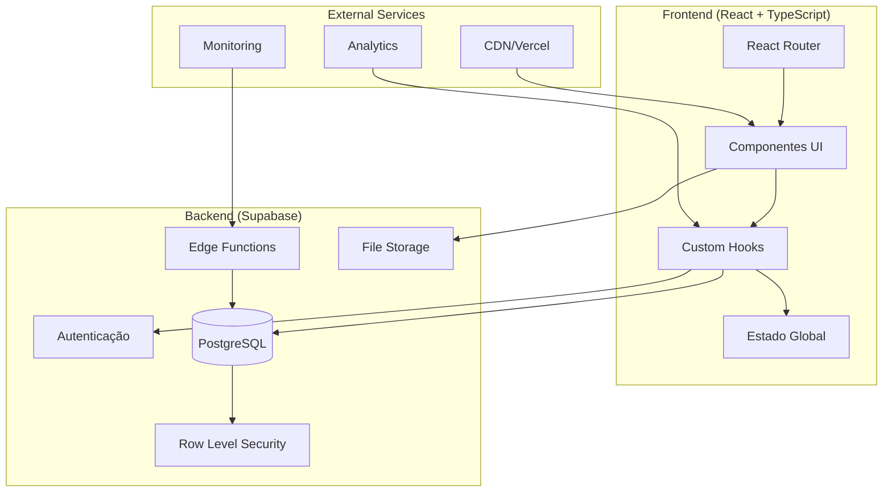

# Arquitetura do Sistema

## 🏗️ Visão Geral da Arquitetura

O sistema segue uma arquitetura moderna baseada em componentes React com backend Supabase, priorizando performance, segurança e maintainability.

## 📊 Diagrama de Arquitetura



## 🔧 Componentes Principais

### Frontend Architecture

#### 1. **Presentation Layer**
```typescript
// Componentes organizados por funcionalidade
src/components/
├── ui/              # Componentes base (Design System)
├── Equipment/       # Domínio: Equipamentos
├── Projects/        # Domínio: Projetos  
├── Layout/          # Layout e navegação
└── Security/        # Componentes de segurança
```

#### 2. **Business Logic Layer**
```typescript
// Hooks customizados com lógica de negócio
src/hooks/
├── useEquipment.ts     # Gestão de equipamentos
├── useProjects.ts      # Gestão de projetos
├── useAuth.ts          # Autenticação
├── useUserRole.ts      # Controle de acesso
└── useSecurityMonitoring.ts # Monitoramento
```

#### 3. **Data Layer**
```typescript
// Integrações e tipos
src/integrations/supabase/
├── client.ts           # Cliente Supabase configurado
└── types.ts            # Tipos auto-gerados

src/types/
├── common.ts           # Tipos compartilhados
├── database.ts         # Tipos de banco
├── equipment.ts        # Domínio: Equipment
└── project.ts          # Domínio: Project
```

### Backend Architecture (Supabase)

#### 1. **Database Schema**
```sql
-- Principais tabelas
equipments          # Catálogo de equipamentos
projects           # Projetos de produção
loans              # Empréstimos ativos
user_roles         # Controle de acesso
audit_logs         # Logs de auditoria
security_alerts    # Alertas de segurança
```

#### 2. **Row Level Security (RLS)**
```sql
-- Exemplo de política RLS
CREATE POLICY "Users can view their own projects" 
ON projects FOR SELECT 
USING (auth.uid() = responsible_user_id OR has_role(auth.uid(), 'admin'));
```

#### 3. **Edge Functions**
```typescript
// Funções serverless para lógica customizada
supabase/functions/
├── process-equipment-images/    # Processamento de imagens
├── security-scan/              # Scan de segurança
└── audit-logger/               # Logger centralizado
```

## 🔐 Segurança

### 1. **Autenticação Multi-Layer**
```typescript
// Fluxo de autenticação
User Login → Supabase Auth → JWT Token → RLS Policies → Data Access
```

### 2. **Controle de Acesso**
```typescript
// Roles e permissões
type UserRole = 'admin' | 'user';

interface Permissions {
  canDelete: boolean;
  canImport: boolean; 
  canViewAll: boolean;
}
```

### 3. **Auditoria Completa**
```typescript
// Log estruturado de todas as ações
interface AuditLogData {
  action: string;
  tableName: string;
  recordId?: string;
  oldValues?: JsonValue;
  newValues?: JsonValue;
  userId?: string;
  ipAddress?: string;
  userAgent?: string;
}
```

## 📊 Fluxo de Dados

### 1. **Estado da Aplicação**
```typescript
// Padrão de gerenciamento de estado
interface AppState {
  equipment: Equipment[];
  projects: Project[];
  auth: AuthState;
  ui: UIState;
}

// Hooks como source of truth
const equipment = useEquipment();
const projects = useProjects();
const auth = useAuth();
```

### 2. **Sincronização de Dados**
```typescript
// Real-time updates via Supabase
useEffect(() => {
  const channel = supabase
    .channel('equipment-changes')
    .on('postgres_changes', {
      event: '*',
      schema: 'public',
      table: 'equipments'
    }, (payload) => {
      // Atualizar estado local
      updateEquipmentState(payload);
    })
    .subscribe();

  return () => supabase.removeChannel(channel);
}, []);
```

## 🎨 Design System

### 1. **Tokens de Design**
```css
/* Cores semânticas em HSL */
:root {
  --primary: 210 40% 50%;
  --secondary: 210 40% 96%;
  --accent: 210 40% 90%;
  --destructive: 0 84% 60%;
  
  /* Gradientes */
  --gradient-primary: linear-gradient(135deg, hsl(var(--primary)), hsl(var(--accent)));
  
  /* Sombras */
  --shadow-lg: 0 10px 15px -3px hsl(var(--primary) / 0.1);
}
```

### 2. **Componentes Reutilizáveis**
```typescript
// Variantes consistentes
const buttonVariants = cva("inline-flex items-center justify-center", {
  variants: {
    variant: {
      default: "bg-primary text-primary-foreground",
      secondary: "bg-secondary text-secondary-foreground",
      destructive: "bg-destructive text-destructive-foreground"
    },
    size: {
      default: "h-10 px-4 py-2",
      sm: "h-9 px-3",
      lg: "h-11 px-8"
    }
  }
});
```

## 📈 Performance

### 1. **Otimizações Frontend**
```typescript
// Lazy loading de componentes
const EquipmentPage = lazy(() => import('@/pages/Equipment'));

// Memoização estratégica
const filteredEquipment = useMemo(() => {
  return equipment.filter(applyFilters);
}, [equipment, filters]);

// Debounce em buscas
const debouncedSearch = useDebounce(searchTerm, 300);
```

### 2. **Otimizações Backend**
```sql
-- Índices estratégicos
CREATE INDEX idx_equipment_category ON equipments(category);
CREATE INDEX idx_projects_responsible ON projects(responsible_user_id);
CREATE INDEX idx_loans_status ON loans(status) WHERE status = 'active';
```

## 🧪 Testing Strategy

### 1. **Pirâmide de Testes**
```typescript
// Testes unitários (70%)
describe('useEquipment hook', () => {
  it('should fetch equipment data', () => {
    // Test hook logic
  });
});

// Testes de integração (20%)
describe('Equipment CRUD flow', () => {
  it('should create, update and delete equipment', () => {
    // Test component integration
  });
});

// Testes E2E (10%)
describe('Full user workflow', () => {
  it('should complete equipment loan process', () => {
    // Test complete user journey
  });
});
```

### 2. **Mocking Strategy**
```typescript
// Mock Supabase client
vi.mock('@/integrations/supabase/client', () => ({
  supabase: mockSupabaseClient
}));

// Mock factories
export const createMockEquipment = (overrides = {}) => ({
  id: 'test-id',
  name: 'Test Equipment',
  // ... defaults
  ...overrides
});
```

## 🚀 Deployment

### 1. **Build Pipeline**
```yaml
# GitHub Actions
name: CI/CD Pipeline
on: [push, pull_request]
jobs:
  test:
    - run: npm run test:coverage
    - run: npm run lint
    - run: npm run type-check
  
  deploy:
    - run: npm run build
    - run: vercel --prod
```

### 2. **Environment Configuration**
```typescript
// Multi-environment setup
const config = {
  development: {
    supabaseUrl: process.env.VITE_SUPABASE_URL_DEV,
    logLevel: 'debug'
  },
  production: {
    supabaseUrl: process.env.VITE_SUPABASE_URL_PROD,
    logLevel: 'error'
  }
};
```

## 🔄 Data Flow Patterns

### 1. **Error Handling Pattern**
```typescript
// Padrão Result<T, E> para operações que podem falhar
type Result<T, E = AppError> = 
  | { success: true; data: T; error?: never }
  | { success: false; data?: never; error: E };

// Uso em hooks
const addEquipment = async (equipment: Equipment): Promise<Result<Equipment>> => {
  const result = await wrapAsync(async () => {
    // Database operation
    return await supabase.from('equipments').insert(equipment);
  });
  
  return result;
};
```

### 2. **Logging Pattern**
```typescript
// Logging estruturado
logger.apiCall('addEquipment', 'POST', '/equipments', { equipmentId });
logger.userAction('equipment_created', { userId, equipmentId });
logger.security('unauthorized_access_attempt', { userId, resource: 'admin_panel' });
```

## 📚 Padrões e Convenções

### 1. **Naming Conventions**
```typescript
// Interfaces: PascalCase
interface EquipmentFilters { }

// Hooks: camelCase com 'use' prefix
function useEquipment() { }

// Components: PascalCase
function EquipmentCard() { }

// Constants: SCREAMING_SNAKE_CASE
const MAX_UPLOAD_SIZE = 5 * 1024 * 1024;
```

### 2. **File Organization**
```typescript
// Grouping by feature, not by type
src/
├── equipment/
│   ├── components/
│   ├── hooks/
│   ├── types/
│   └── utils/
└── projects/
    ├── components/
    ├── hooks/
    ├── types/
    └── utils/
```

Esta arquitetura garante escalabilidade, maintainability e performance, seguindo as melhores práticas da indústria.